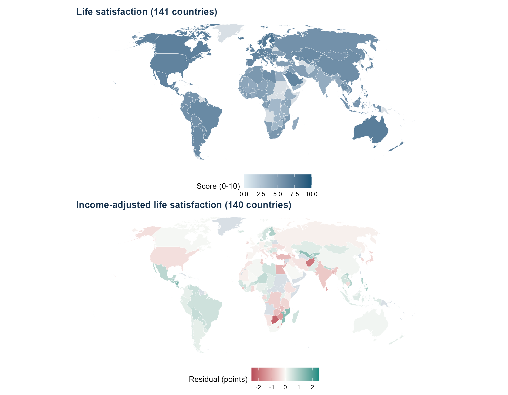
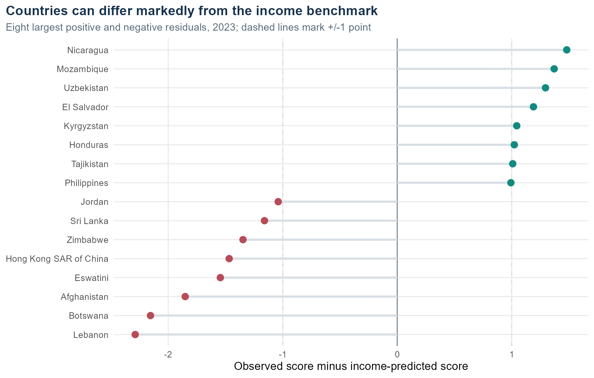

# Beyond Income — What Explains National Life Satisfaction?

A fully reproducible analysis of how national income relates to self-reported life
satisfaction across 157 countries, combining the World Happiness Report with World Bank
development indicators and Natural Earth geographic data.

**Built in R** · Quarto · ggplot2 · sf · Leaflet



---

## The question

Income predicts happiness well — but not perfectly. This project asks two things:

1. **How much does income actually explain?**
2. **Which countries sit far from what their income predicts, and does anything else explain the gap?**

## What we found

**Income explains most of it, and little else adds anything.**
Log GDP per capita alone explains **69%** of the variation in life satisfaction across
140 countries (slope 0.67 points per log unit). Adding life expectancy and urbanisation
changes R² by **0.0005** (p = 0.89) — and actually makes out-of-sample prediction *worse*
(leave-one-out RMSE 0.654 → 0.670). More predictors are not automatically a better model.

**Education spending is the one variable that survives.**
Among 114 countries with comparable data, public education spending as a share of GDP adds
a small but statistically detectable effect (+0.12 points per percentage point, ΔR² = 0.026,
HC3 p = 0.026), on top of income.

**Only 16 of 140 countries are more than a point away from their income prediction.**
Seven sit at least one point above (Nicaragua, Mozambique, Uzbekistan, El Salvador,
Kyrgyzstan, Honduras, Tajikistan) and nine at least one point below (Lebanon, Botswana,
Afghanistan, Eswatini, Hong Kong, Zimbabwe, Sri Lanka, Jordan, Egypt). The other 124 cluster
tightly around the line.

**A geographic pattern that disappears on inspection.**
Latitude correlates with life satisfaction at r = 0.41 — northern countries report higher
scores. But once income is accounted for, the correlation with the residual drops to
**r = 0.05**. The apparent "latitude effect" is almost entirely an income effect.



---

## Interactive map

### ▶ [**Open the live country explorer**](https://zeynepcn44.github.io/beyond-income/)

A standalone Leaflet map — no server, no tile provider, no API key. The same file
(`Outputs/country_explorer.html`) also works offline if you download it.

It has a **residual-band filter**: tick boxes switch the three groups on and off, so you can
isolate the countries income fails to explain.

| Layer | Countries |
|---|---|
| At least 1 point above income prediction | 7 |
| Within 1 point of prediction | 124 |
| At least 1 point below income prediction | 9 |
| No comparable data | 96 |
| Life satisfaction, raw score | 236 |

Each country opens a popup with its score, GDP per capita, income-predicted score, residual,
and a hand-drawn SVG sparkline of its 2016–2023 trajectory.

---

## Methods

- **Join.** Two World Happiness Report sheets reconstructed and merged with World Bank
  indicators on ISO3 codes, then joined to Natural Earth polygons via `ISO_A3_EH`
  (not `ISO_A3`, which stores −99 for several countries).
- **Design.** Cross-sectional at the 2023 survey-window endpoint, to avoid treating repeated
  country observations as independent.
- **Models.** Seven OLS specifications with HC3 robust standard errors, VIF checks,
  Breusch–Pagan tests, Cook's distance, and leave-one-out RMSE. Nested comparisons always
  use identical samples.
- **Missing data kept, never dropped.** No global `na.omit()`. Each analysis filters only
  what it needs and reports its own N.
- **One trap avoided.** The World Happiness Report's own explanatory components sum *exactly*
  to the score they explain (r = 1.0000). Using them as predictors would be circular, so
  they are excluded from all models.

## Reproduce it

```r
source("Scripts/install_packages.R")   # once
source("Scripts/run_analysis.R")       # data → models → 16 figures → map
```

```bash
quarto render report.qmd --to typst   # PDF, 23 pages
quarto render report.qmd --to html    # HTML with foldable code
```

Everything rebuilds from the raw workbook. No absolute paths, no network access, no API key.
Verified from a clean extract: all 16 figures byte-identical, model results identical to
machine precision.

## Repository

```
Data/            Raw workbook, Natural Earth GeoJSON, source audit
Scripts/
  01_prepare.R           read, type-check, join, reconstruct
  02_models.R            OLS fits, HC3 intervals, diagnostics
  03_visualise.R         summary statistics and 16 figures
  04_interactive_map.R   Leaflet layers, residual-band filter, popups
  run_analysis.R         single entry point
report.qmd       Quarto source for both output formats
Outputs/         16 figures, 30 tables, interactive map, validation log
```

## Notes

Group project for the R Bootcamp (2 people). **My contribution:** the data pipeline and
reproducibility checks, all 16 figures, the interactive Leaflet map including the
residual-band filter and SVG popups, and the report build.

Associations are descriptive. Country-level residuals are not causal effects, and nothing
here supports claims about individual people.

**Sources:** World Happiness Report · World Bank World Development Indicators ·
Natural Earth (1:50m admin 0 countries)
